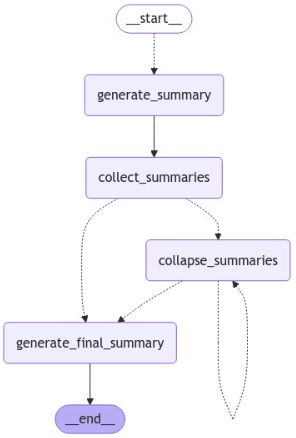

# Agentic Multi-Modal LLM

## Problem Analysis
We aim to leverage a Large Language Model (LLM) to recommend our next book to read. This objective brings to mind the development of a Recommender System, traditionally approached in three primary ways:
- **Content-Based Recommendation**: Suggests items by comparing contextual similarities between them, often using text-based measures like Cosine Similarity.
- **User-Based Recommendation**: Recommends items based on a user’s previous ratings or preferences.
- **Collaborative Filtering**: Recommends items by analyzing the history of users with similar preferences.

However, since we plan to use an **LLM**, we require a different approach:
- The above methods are not feasible here, as we lack user interaction or ratings data—our only input is the collection of books themselves. Consequently, we need a recommendation model based on the semantic meaning of the books.
- While we might consider a **Retrieval-Augmented Generation (RAG)** approach, this would not fully meet our needs. **RAG** systems are designed for search applications and tend to dive deeply into available documents to find the most relevant information. Although RAG could identify related documents associated with the last book read, it analyzes only small document chunks rather than entire texts, making it unlikely to yield the desired recommendations.

For summarizing, we applied this flow: 




This repo covers a possible approach, including:
- Extracting both texts and images within each documents
- Leveraged `Langgraph` for running `map-reduce` together with parallelization for document compression
- Extract the meaning of the images, then put it together with document summary into `Chroma` for a `Semantic Layer`
- Extract `Entities` and store into `Neo4J` for a `Knowledge Graph Retriever`
- Behavior monitoring with `LangSmith` and `Rotating File Handler`
- Chat history persitent using `sqlite` for long-term memory
- Applied `Multi Vector Retriever` together with `Serper AI` for enhancing the chatbot with the capability of doing web searching
- Compacted everything together on a single UI using `Streamlit`

## Note
- For convience, I've also uploaded the `.env` file. Don't forget to upload your own `OpenAI Key`, and you can also change other keys for your own project.
- `Graph builder` may take a good amount of time (have not been optimized for `batching & parralel`)
- This repo aims at showcasing the combination of different techniques without worrying too much about running speed at this time

## Running Instruction

```
python3 -m venv .venv
. .venv/bin/activate
pip install -r. requirements.txt

# Open one terminal
docker compose up

# Open another terminal
streamlit run app.py
```
